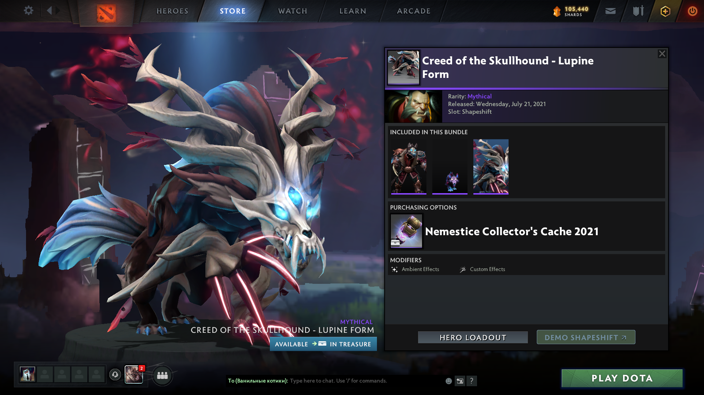
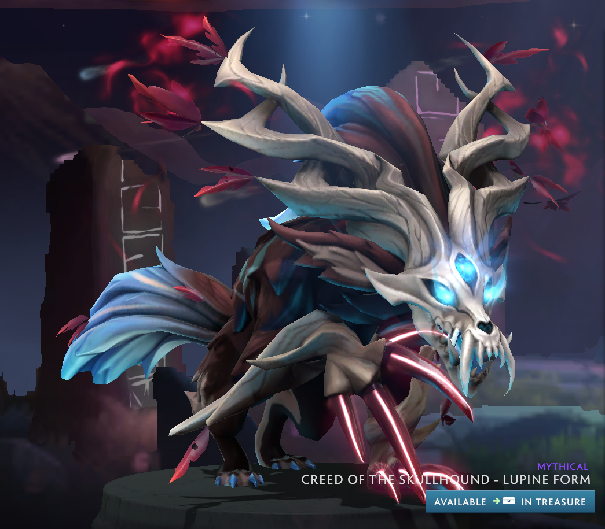

# Image Cropper
## Description
### Why was the program created?
The program was created to automate the image cropping process. I used it to crop the image to prettify the look of the sets for DOTA 2 items to later sell the items on eBay.

Basically, it was turning this:

Into this:

But program allows to do that on a large scale.

## Installation
### Virtual Environment
First, you need to set up virtual environment for your system.
You can read more about it here:  
&nbsp;&nbsp;&nbsp;&nbsp;&nbsp;&nbsp;&nbsp;[Installing packages using pip and virtual environments](https://docs.python.org/3/library/venv.html)  
&nbsp;&nbsp;&nbsp;&nbsp;&nbsp;&nbsp;&nbsp;[venv — Creation of virtual environments](https://docs.python.org/3/library/venv.html)  
&nbsp;&nbsp;&nbsp;&nbsp;&nbsp;&nbsp;&nbsp;[How to activate virtual environment](https://docs.python.org/3/tutorial/venv.html)  

### Requirements
After activating virtual environment, you need to install requirements.
You can do it by typing following command:  
&nbsp;&nbsp;&nbsp;&nbsp;&nbsp;&nbsp;&nbsp;`pip install -r requirements.txt`

### Prepare The Files
Prepare the images you want to crop, and prepare text file with names. The names will be assigned in the ascending order. Make sure that the `number of names` **is equal** to `number of images`.

### Setting Up Environment Variables
The only thing you need to do, is to copy and paste `.env.example`, remove `.example` extension from it, making it `.env`.
Then fill out the fields in file.
`Every field` in the file is `REQUIRED`.
If there will be any error, the program will let you know about it.

### Run
To run the program, basically run `main.py`.
You can do it by typing the following command:  
&nbsp;&nbsp;&nbsp;&nbsp;&nbsp;&nbsp;&nbsp;`python main.py`
